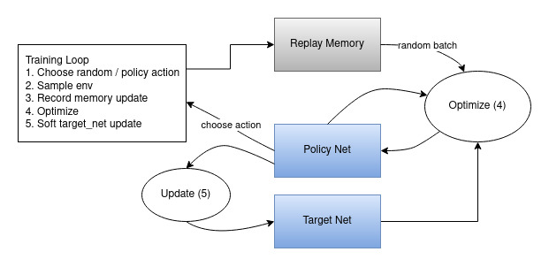
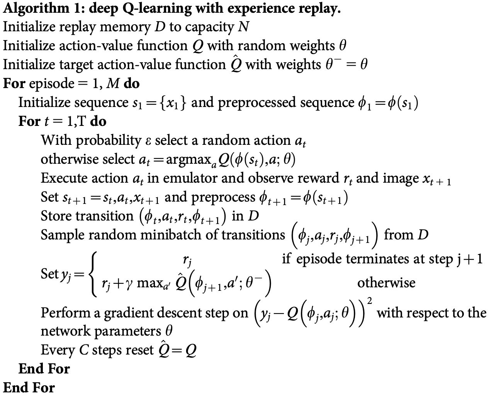

# Deep Q-network
The paper this concept originates from is [Human-level control through deep reinforcement
learning](https://www.nature.com/articles/nature14236) (2015)

## Paper Review (Key insights)
**Experience replay is used to stablize Q-value**
- randomizes over the data
-  iterative update that only adjust Q-value to target value periodically
- loss function: update using experiences $(s,a,r,s')$ drawed from pool of stored samples
```math
L_i(\theta_i) = \mathbb{E}_{(s,a,r,s') \sim \mathbb{U}(D)} \left[ \left( r + \gamma \max_{a'} Q(s', a'; \theta_i^-) - Q(s, a; \theta_i) \right)^2 \right]
```

**Q-network is a neural network function approximator with weights $\theta$**
- Q-network is trained to adjust parameters $\theta_i$ at iteration i
```math
L_i(\theta_i) = \mathbb{E}_{s,a,r} \left[ \left(\mathbb{E}_{s'}[y | s,a] - Q(s,a; \theta_i) \right)^2 \right]
= \mathbb{E}_{s,a,r,s'} \left[ \left( y - Q(s,a; \theta_i) \right)^2 \right] + \mathbb{E}_{s,a,r} \left[ \mathbb{V}_{s'} [y] \right]
```
```math
y = r + \gamma \max_{a'} Q(s', a'; \theta_i^-)
\text{ from some previous iterations $\theta_{i-1}$}
```
```math
\nabla_{\theta_i} L(\theta_i) = \mathbb{E}_{s,a,r,s'} \left[
\left( r + \gamma \max_{a'} Q(s', a'; \theta_i^-) - Q(s,a; \theta_i) \right)
\nabla_{\theta_i} Q(s,a; \theta_i)
\right]
```
- During each iteration, trajectories are obstained using $Q$, Q-function; target network $\hat{Q}(\theta)$ is updated using experience replay. At end of iteration, $Q\leftarrow \hat{Q}$.

## Algorithm
**DQN Data Flow (from [Pytorch Tutorial](https://pytorch.org/tutorials/intermediate/reinforcement_q_learning.html))**  
  

**DQN Algorithm (from Paper [Human-level control through deep reinforcement
learning](https://www.nature.com/articles/nature14236))**  
