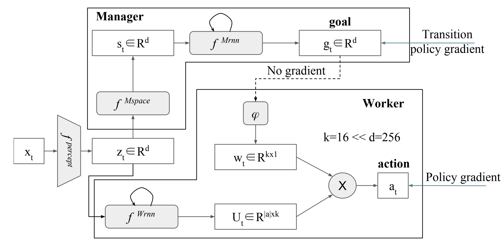

# FeUdal Networks (FuN)

The paper this concept originates from is [FeUdal Networks for Hierarchical Reinforcement Learning](https://arxiv.org/pdf/1703.01161) (2017)

## Paper Review (Key insights)
- **Hierarchical decomposition**: splits the agent into a **Manager** and a **Worker** to learn at different temporal scales
- **Goal embedding space**: the Manager outputs **directional goals** in latent state space
- **Intrinsic motivation**: the Worker is trained to follow Manager goals using **intrinsic rewards**
- **Temporal abstraction**: the Manager outputs goals every *k* steps

## Algorithm

FeUdal Networks consist of two modules:

1. **Manager**: a higher-level module that outputs a goal vector $g_t \in \mathbb{R}^d$ every $k$ steps
2. **Worker**: a low-level policy that receives $g_t$ and acts to achieve it by maximizing a cosine similarity-based intrinsic reward

### Goal Embedding Space:
The Manager learns in a **learned latent space** $s_t$, generated from raw observations via a state encoder.

### Intrinsic Reward:
The Worker is trained with an intrinsic reward:
```math
r^I_t = \cos(s_{t+c} - s_t, g_t)
```
where $s_t$ and $s_{t+c}$ are state embeddings and $g_t$ is the goal from the Manager.

### Manager Optimization:
The Manager maximizes the **extrinsic reward** by learning to emit goal directions that lead the Worker to maximize future returns

---



---