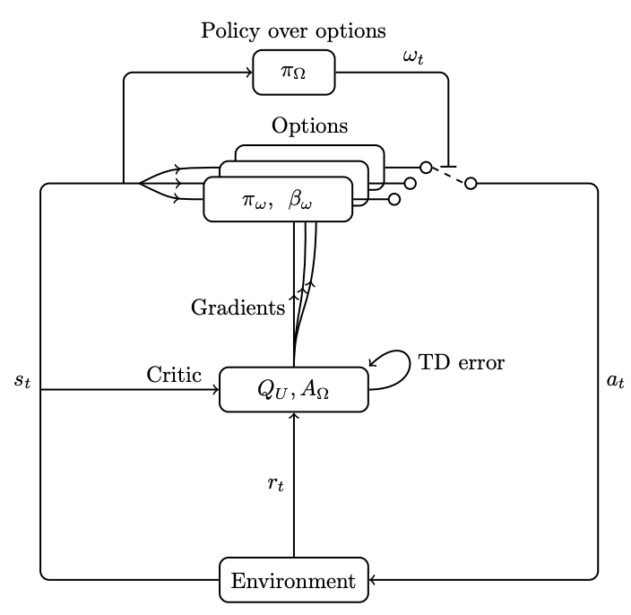
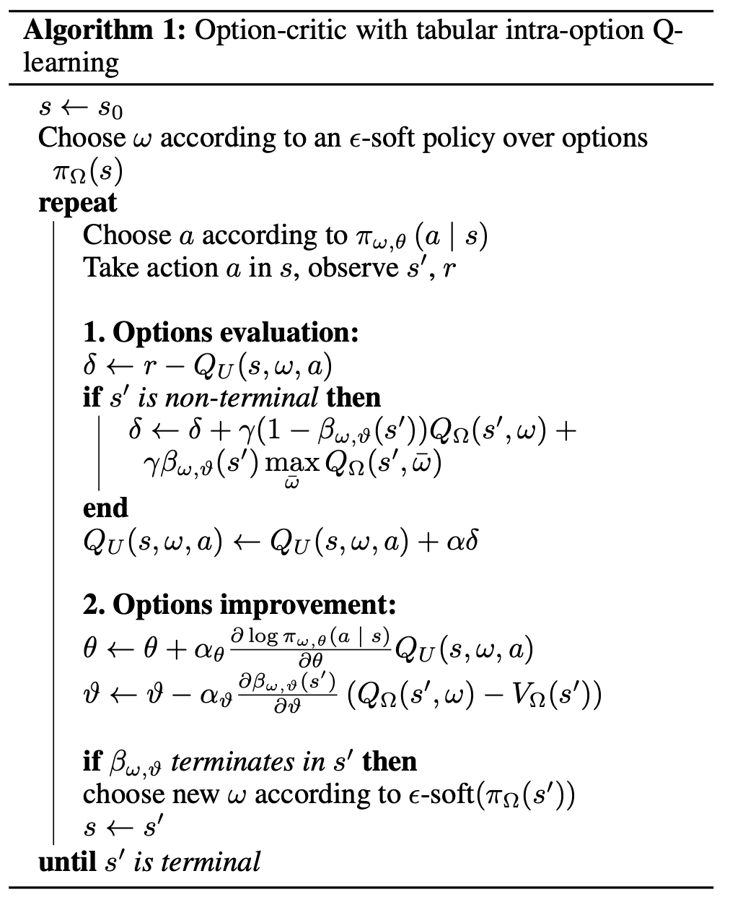

# Option-Critic
The paper this concept originates from is [The Option-Critic Architecture](https://arxiv.org/abs/1609.05140) (2016)

## Paper Review (Key insights)
- **intra-option policy gradients**: allow options to be updated without waiting for termination.
- **termination gradient**: optimize when to continue or terminate an option.
- **temporal abstraction**: options can improve exploration and stability in reinforcement learning.
- The method is applicable to both tabular and function-approximation settings, making it compatible with deep RL methods.
- :warning: Non modularity: learned options are not well-defined behaviors and cannot generalize other configurations.


## Algorithm
The Option-Critic architecture extends **actor-critic** with **options**.
Each option is defined by:
1. **An intra-option policy** $\pi_{\omega}$ dictating actions within the option.
2. **A termination function** $\beta_{\omega, \theta}$ deciding when to switch options.
3. **A policy-over-options** $\pi_{\Omega}$, which chooses among available options.
# add an image


The objective function is optimized via **option-value functions**:
```math
Q_{\Omega}(s, \omega) = \sum_{a} \pi_{\omega, \theta} (a \mid s) Q_{U}(s, \omega, a)
```
```math
Q_U(s, \omega, a) = r(s, a) + \gamma \sum_{s'} P(s' \mid s, a) U(\omega, s')
```
