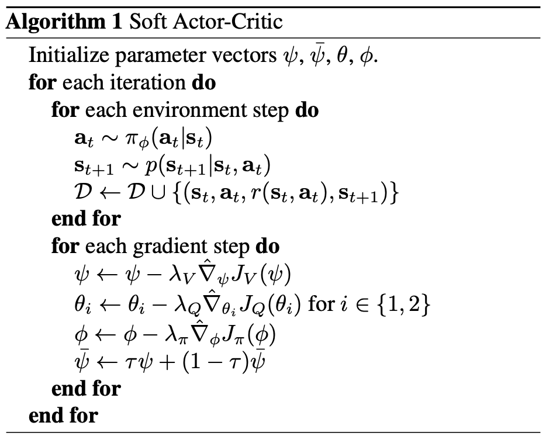

# Soft Actor-Critic
The paper this concept originates from is [Soft Actor-Critic: Off-Policy Maximum Entropy Deep Reinforcement Learning with a Stochastic Actor](https://arxiv.org/abs/1801.01290) (2018)

- off-policy, model-free methods
- maximize entropy and expected reward
- very stable
    - many off-policy suffers from instability due to increasing complexity
- sample efficiency
    - many on-policy learnings requires new samples to be collected during each gradient step (policy gradient algos)
- stochastic actor + entropy maximization objective = stable and scalable

## Paper Review (Key insights)
**Objective Function:**
```math
J(\pi) = \sum_{t=0}^{T} \mathbb{E}_{(s_t, a_t) \sim \rho_{\pi}} \left[ r(s_t, a_t) + \alpha \mathcal{H}(\pi(\cdot | s_t)) \right]
```
**Soft policy iteration framework**
- alternates between policy evaluation and policy improvement
-  soft policy iteration converges to the optimal policy within a set of policies which might correspond to a set of parameterized densities (such as **Gaussians**)
```math
\mathcal{T}^{\pi} Q(s_t, a_t) \triangleq r(s_t, \mathbf{a}_t) + \gamma \mathbb{E}_{s_{t+1} \sim p} \left[ V(s_{t+1}) \right]
```
where
```math
V(s_t) = \mathbb{E}_{a_t \sim \pi} \left[ Q(s_t, \mathbf{a}_t) - \log \pi(a_t | s_t) \right]
```
- Use Kullback-Leibler divergence as information projection
```math
\pi_{\text{new}} = \arg\min_{\pi' \in \Pi} D_{\text{KL}} \left( \pi'(\cdot | s_t) \Bigg\| \frac{\exp \left(Q^{\pi_{\text{old}}} (s_t, \cdot)\right)}{Z^{\pi_{\text{old}}}(s_t)} \right)
```
### Algorithm


### Mapping Updates to Derivations

#### **1. Value Function Update** (Updating ψ)
- **Soft value function**
  $\psi \leftarrow \psi - \lambda_V \nabla_{\psi} J_V(\psi)$
- Trained to minimize the squared residual error:
```math
  J_V(\psi) = \mathbb{E}_{(s_t, a_t) \sim \mathcal{D}} \left[ \frac{1}{2} (V_{\psi}(s_t) - \mathbb{E}_{a_t \sim \pi_{\phi}} [Q_{\theta}(s_t, a_t) - \log \pi_{\phi}(a_t | s_t)])^2 \right]
```
```math
  \nabla_{\psi} J_V(\psi) = \nabla_{\psi} V_{\psi}(s_t) (V_{\psi}(s_t) - Q_{\theta}(s_t, a_t) + \log \pi_{\phi}(a_t | s_t))
```

#### **2. Q-Function Update** (Updating θ)
- $\theta_i \leftarrow \theta_i - \lambda_Q \nabla_{\theta_i} J_Q(\theta_i), \quad i \in \{1,2\}$
- Minimizes the soft Bellman residual:
```math
  J_Q(\theta) = \mathbb{E}_{(s_t, a_t) \sim \mathcal{D}} \left[ \frac{1}{2} (Q_{\theta}(s_t, a_t) - \hat{Q}(s_t, a_t))^2 \right]
```
```math
  \hat{Q}(s_t, a_t) = r(s_t, a_t) + \gamma \mathbb{E}_{s_{t+1} \sim p} [V_{\bar{\psi}}(s_{t+1})]
```
```math
  \nabla_{\theta} J_Q(\theta) = \nabla_{\theta} Q_{\theta}(s_t, a_t) (Q_{\theta}(s_t, a_t) - r(s_t, a_t) - \gamma V_{\bar{\psi}}(s_{t+1}))
```

#### **3. Policy Update** (Updating ϕ)
- $\phi \leftarrow \phi - \lambda_{\pi} \nabla_{\phi} J_{\pi}(\phi)$
- Minimizes the KL divergence between the policy and an energy-based distribution:
```math
  J_{\pi}(\phi) = \mathbb{E}_{s_t \sim \mathcal{D}} \left[ D_{\text{KL}} \left( \pi_{\phi}(\cdot | s_t) \Bigg\| \frac{\exp(Q_{\theta}(s_t, \cdot))}{Z_{\theta}(s_t)} \right) \right]
```
```math
  \nabla_{\phi} J_{\pi}(\phi) = \mathbb{E}_{a_t \sim \pi_{\phi}} \left[ \nabla_{\phi} \log \pi_{\phi}(a_t | s_t) \left( \alpha \log \pi_{\phi}(a_t | s_t) - Q_{\theta}(s_t, a_t) \right) \right]
```

#### **4. Target Value Function Update** (Updating ψ̄)
- $\bar{\psi} \leftarrow \tau \psi + (1 - \tau) \bar{\psi}$
- This step ensures smooth updates to the target value function $V_{\bar{\psi}}(s_t)$ to stabilize training. The target network is an exponential moving average of the value function.


